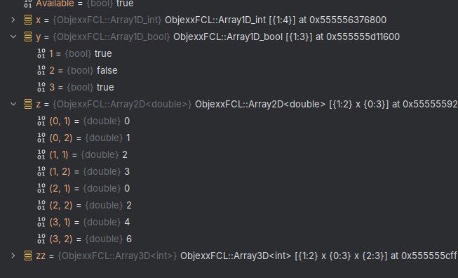

# GDB Pretty Printers

Right now this just supports Objexx Arrays up to 3D.

## Using

To use, check out this repo somewhere on your machine, or drop the `printers/array.py` file somewhere you can find it.
Then, in your `~/.gdbinit` file, add the following lines:

```
python
import sys
sys.path.insert(0, "/path/to/GDBPrettyPrinters/printers")
import array
print("Loaded Objexx Array pretty printer")
end
```

Next time you run gdb, the pretty printer should be loaded, and in a suitable context, you should see something like this:



## Developing

If you open this project, it _should_ load up the stubs folder automatically for code completion.
The GDB stub file is not complete, but is sufficient for the API calls used in this pretty printer.
If it isn't found by default, and your IDE complains about not being able to import gdb, you can mark the stubs folder as a "Sources Root" or equivalent in your IDE.

## Testing

Yes!

## Contributing

I welcome more printers and added GDB stubs if you want to contribute!
